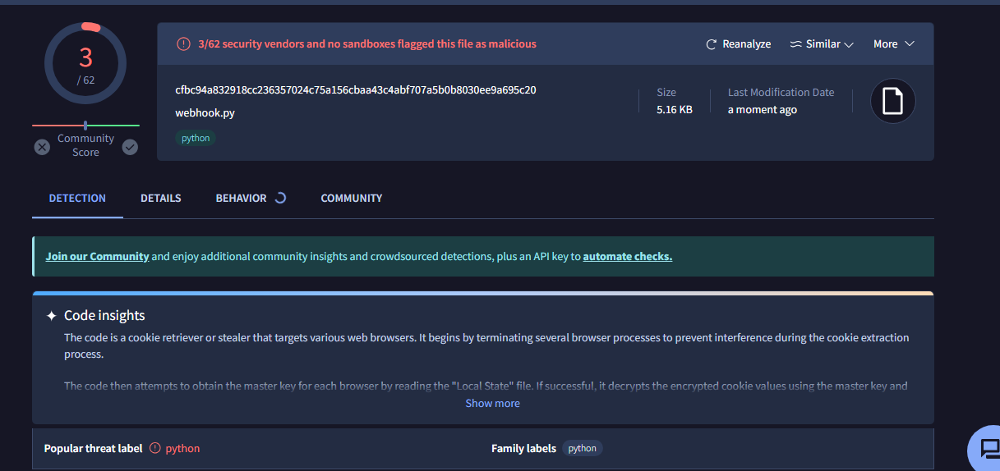
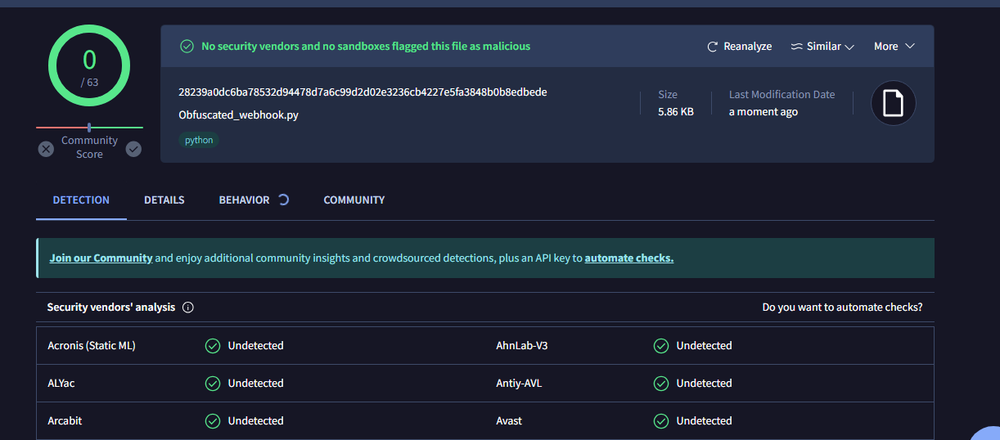

# Python Code Obfuscator

- In executables also decreases detections!
- Recommend Python 3.12

# Behavior 🧬

## Without OBF 🔓



## With OBF 🔐



# Guide

```
python obf.py script_name.py
```

`To the encrypted file you must import the modules that your stub uses`

# Contact 🧲

@notes_it_gk - channel for developers
t.me/in_touch_prog (me)
